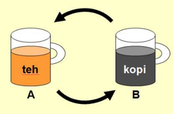
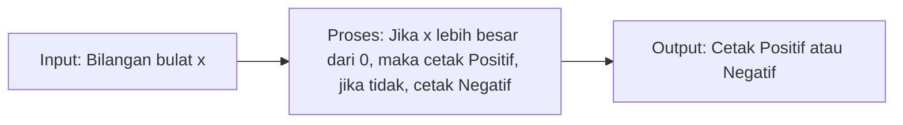
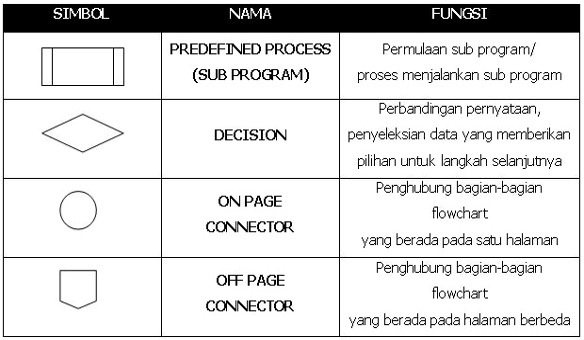
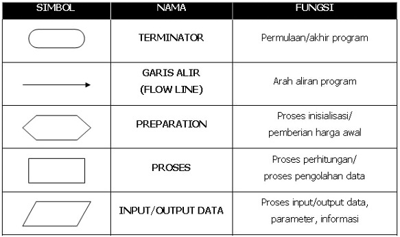
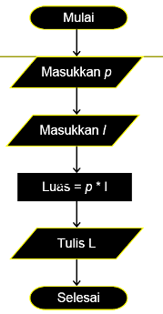
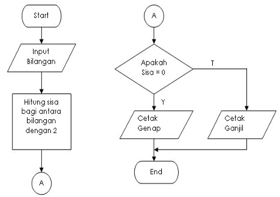
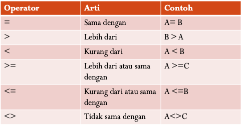
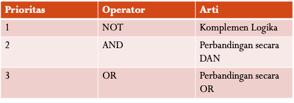
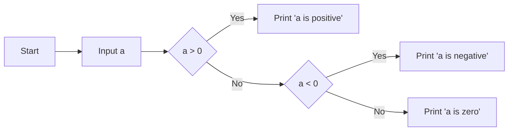
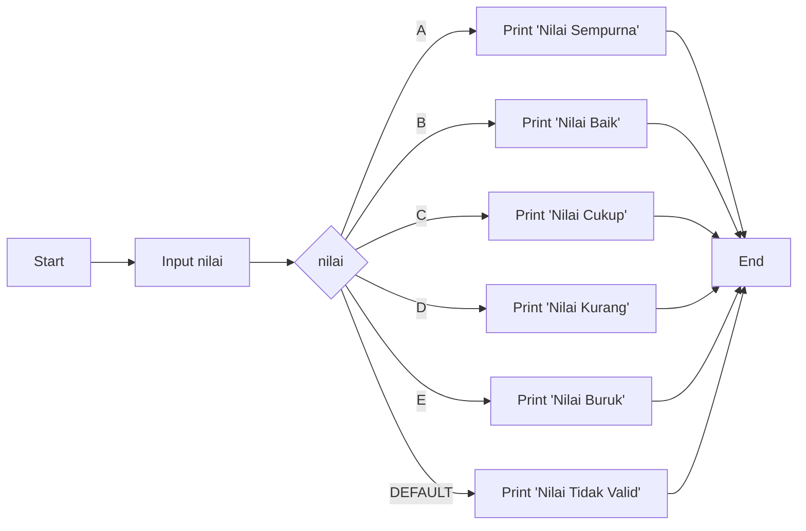

### Ringkasan Logika dan Algoritma
#### Pengantar Logika
Permasalahan atau persoalan adalah sesuatu hal yang harus diselesaikan dengan cara yang tepat dan efektif

Contoh permasalahan:
* Apakah 2 buah bilangan itu sama?
* Apakah 2 buah bilangan itu berbeda?
* Apakah 2 buah bilangan itu lebih besar?
* Apakah 2 buah bilangan itu lebih kecil?

Logika adalah ilmu yang mempelajari tentang cara-cara untuk menyelesaikan permasalahan dengan cara yang tepat dan efektif

#### Sejarah Algortima
* Algoritma adalah suatu langkah-langkah yang sistematis untuk menyelesaikan suatu persoalan
* Algoritma berasal dari kata algorism yang artinya proses menghitung dengan angka arab
* Perubahan kata algorism menjadi algorithm muncul karena ata algorism sering dikelirukan dengan arithmatic, sehingga akhiran -ism dihilangkan dan diganti dengan -thm

Contoh algoritma untuk memindahkan teh dari gelas A ke gelas B yang berisi kopi adalah sebagai berikut:



Maka algoritma tersebut dapat ditulis sebagai berikut:
- Sediakan gelas C kosong, gelas A berisi teh, dan gelas B berisi kopi
- Tuangkan teh dari gelas A ke gelas C
- Tuangkan kopi dari gelas B ke gelas A
- Tuangkan teh dari gelas C ke gelas B
- Selesai

#### Karakteristik Algoritma
* Algoritma harus berhenti setelah selesai menyelesaikan persoalan
* Setiap langkah harus jelas, pasti dan tidak ambigu
* Setiap langkah harus dapat dijalankan secara berurutan
* Algoritma memiliki input dan output

#### Syarat Algoritma Yang Baik
* Memiliki kepercayaan yang tinggi
  * Hasil yang diperoleh dari algoritma tersebut harus benar dan memiliki tingkat akurasi yang tinggi
* Pemprosesan yang efisien
  * Algoritma tersebut harus dapat menyelesaikan persoalan dengan cepat dan efisien
* Sifatnya general
  * Algoritma tersebut harus dapat digunakan untuk menyelesaikan persoalan yang berbeda-beda
* Sifatnya reusable
  * Algoritma tersebut harus dapat digunakan kembali untuk menyelesaikan persoalan yang sama
* Sifatnya modular
  * Algoritma tersebut harus dapat dibagi menjadi beberapa bagian yang lebih kecil
* Sifatnya terstruktur
  * Algoritma tersebut harus memiliki struktur yang jelas dan teratur
* Sifatnya mudah dikembangkan
  * Algoritma tersebut harus dapat dikembangkan untuk menyelesaikan persoalan yang lebih rumit
* Sifatnya mudah dipelajari
  * Algoritma tersebut harus mudah dipelajari dan dipahami
* Sifatnya mudah diimplementasikan
  * Algoritma tersebut harus mudah diimplementasikan dalam bentuk program komputer
* Sifatnya mudah diuji
  * Algoritma tersebut harus mudah diuji untuk mengetahui apakah algoritma tersebut sudah benar atau belum
* Sifatnya mudah dijelaskan
  * Algoritma tersebut harus mudah dijelaskan kepada orang lain

#### Program dan Pemrograman
* Program adalah sekumpulan instruksi yang ditulis dalam bahasa pemrograman yang dapat dijalankan oleh komputer untuk menyelesaikan suatu persoalan
* Pemrograman adalah proses menulis program dengan menggunakan bahasa pemrograman

#### Notasi Algoritma
* Notasi algoritma adalah cara untuk menulis algoritma dengan menggunakan simbol-simbol tertentu
* Notasi algoritma yang paling umum adalah notasi algoritma bahasa Inggris
* Notasi algoritma bahasa Inggris terdiri dari 3 bagian, yaitu:
  * Input
  * Proses
  * Output
* Contoh notasi algoritma bahasa Inggris adalah sebagai berikut:
* Input: Bilangan bulat x
* Proses: Jika x lebih besar dari 0, maka cetak "Positif", jika tidak, cetak "Negatif"
* Output: Cetak "Positif" atau "Negatif"
* Notasi algoritma bahasa Inggris dapat ditulis dalam bentuk diagram alir, yaitu:




Contoh flowchart:




#### Syarat Pembuatan Flowchart
* Flowchart harus dapat menunjukkan langkah-langkah yang harus dilakukan untuk menyelesaikan suatu persoalan
* Flowchart harus dapat menunjukkan input dan output dari suatu program
* Flowchart harus dapat menunjukkan proses yang terjadi dalam suatu program
* Flowchart harus dapat menunjukkan kondisi yang terjadi dalam suatu program

#### Notasi Pseudocode
* Pseudocode adalah notasi algoritma yang menggunakan bahasa Inggris yang lebih sederhana
* Pseudocode terdiri dari 3 bagian, yaitu:
  * Input
  * Proses
  * Output
Contoh pseudocode adalah sebagai berikut:
```
PROGRAM menghitung luas persegi panjang

DEKLARASIKAN panjang, lebar, luas sebagai integer

TULISKAN "Masukkan panjang: "
BACA panjang
TULISKAN "Masukkan lebar: "
BACA lebar

luas <- panjang * lebar

TULISKAN "Luas persegi panjang adalah: ", luas
```

#### Pemrogramman Prosedural
Pemrograman prosedural adalah pemrograman yang menggunakan algoritma prosedural
Pemrograman prosedural terdiri dari 3 bagian, yaitu:
  * Deklarasi variabel
  * Deklarasi prosedur
  * Program utama

Contoh program sederhana yang menggunakan pemrograman prosedural dengan bahasa pemrograman C adalah sebagai berikut:

```c
#include <stdio.h>

int main() {
    int a, b, c;
    a = 10;
    b = 20;
    c = a + b;
    printf("Hasil penjumlahan adalah %d", c);
    return 0;
}
```

#### Pemrogramman Berorientasi Objek
Pemrograman berorientasi objek adalah pemrograman yang menggunakan konsep objek
Pemrograman berorientasi objek terdiri dari 3 bagian, yaitu:
  * Deklarasi kelas
  * Deklarasi objek
  * Program utama

Contoh program sederhana yang menggunakan pemrograman berorientasi objek dengan bahasa pemrograman C++ adalah sebagai berikut: 
```cpp
#include <iostream>
using namespace std;

class Mahasiswa {
    public:
        string nama;
        string nim;
        string jurusan;
};

int main() {
    Mahasiswa mhs;
    mhs.nama = "Naufal Reky Ardhana";
    mhs.nim = "43322021";
    mhs.jurusan = "Teknik Informatika";
    cout << "Nama: " << mhs.nama << endl;
    cout << "NIM: " << mhs.nim << endl;
    cout << "Jurusan: " << mhs.jurusan << endl;
    return 0;
}
```

#### Macam-Macam Tipe Data
| Tipe Data      | Deskripsi                                    | Ukuran  | Nilai Minimum  | Nilai Maksimum |
|----------------|----------------------------------------------|---------|----------------|----------------|
| char           | Tipe data karakter                           | 1 byte  | -128           | 127            |
| unsigned char  | Tipe data karakter tanpa tanda               | 1 byte  | 0              | 255            |
| int            | Tipe data bilangan bulat                     | 2 byte  | -32.768        | 32.767         |
| unsigned int   | Tipe data bilangan bulat tanpa tanda         | 2 byte  | 0              | 65.535         |
| short          | Tipe data bilangan bulat pendek              | 2 byte  | -32.768        | 32.767         |
| unsigned short | Tipe data bilangan bulat pendek tanpa tanda  | 2 byte  | 0              | 65.535         |
| long           | Tipe data bilangan bulat panjang             | 4 byte  | -2.147.483.648 | 2.147.483.647  |
| unsigned long  | Tipe data bilangan bulat panjang tanpa tanda | 4 byte  | 0              | 4.294.967.295  |
| float          | Tipe data bilangan riil                      | 4 byte  | 1.2E-38        | 3.4E+38        |
| double         | Tipe data bilangan riil ganda                | 8 byte  | 2.3E-308       | 1.7E+308       |
| long double    | Tipe data bilangan riil ganda panjang        | 10 byte | 3.4E-4932      | 1.1E+4932      |
| bool           | Tipe data boolean                            | 1 byte  | false          | true           |

Contoh program sederhana yang menggunakan tipe data dengan bahasa pemrograman C adalah sebagai berikut:
```c
#include <stdio.h>

int main() {
    char a = 'A';
    unsigned char b = 65;
    int c = 10;
    unsigned int d = 10;
    short e = 10;
    unsigned short f = 10;
    long g = 10;
    unsigned long h = 10;
    float i = 10.5;
    double j = 10.5;
    long double k = 10.5;
    bool l = true;
    printf("Nilai a adalah %c\n", a);
    printf("Nilai b adalah %c\n", b);
    printf("Nilai c adalah %d\n", c);
    printf("Nilai d adalah %d\n", d);
    printf("Nilai e adalah %d\n", e);
    printf("Nilai f adalah %d\n", f);
    printf("Nilai g adalah %ld\n", g);
    printf("Nilai h adalah %ld\n", h);
    printf("Nilai i adalah %f\n", i);
    printf("Nilai j adalah %lf\n", j);
    printf("Nilai k adalah %Lf\n", k);
    printf("Nilai l adalah %d\n", l);
    return 0;
}
```
#### Variabel
Variabel adalah wadah yang digunakan untuk menyimpan data 
Variabel terdiri dari 3 bagian, yaitu:
  * Nama variabel
  * Tipe data
  * Nilai

Contoh program sederhana yang menggunakan variabel dengan bahasa pemrograman C adalah sebagai berikut:
```c
#include <stdio.h>

int main() {
    int a = 10;
    printf("Nilai a adalah %d\n", a);
    return 0;
}
```

Aturan penulisannya adalah sebagai berikut:
  * Nama variabel tidak boleh diawali dengan angka
  * Nama variabel tidak boleh mengandung spasi
  * Nama variabel tidak boleh mengandung karakter khusus
  * Nama variabel tidak boleh sama dengan kata kunci
  * Nama variabel bersifat case sensitive

#### Konstanta
Konstanta adalah variabel yang nilainya tidak dapat diubah
Konstanta terdiri dari 3 bagian, yaitu:
  * Nama konstanta
  * Tipe data
  * Nilai

Contoh program sederhana yang menggunakan konstanta dengan bahasa pemrograman C adalah sebagai berikut:
```c
#include <stdio.h>

int main() {
    const int a = 10;
    printf("Nilai a adalah %d\n", a);
    return 0;
}
```

Aturan penulisannya adalah sebagai berikut:
  * Nama konstanta tidak boleh diawali dengan angka
  * Nama konstanta tidak boleh mengandung spasi
  * Nama konstanta tidak boleh mengandung karakter khusus
  * Nama konstanta tidak boleh sama dengan kata kunci
  * Nama konstanta bersifat case sensitive

#### Ekspresi 
Ekspresi adalah kombinasi dari variabel, konstanta, operator, dan fungsi yang menghasilkan nilai

Macam-macam eksperesi:
  * Aritmatika
  * Relasional
  * Logika
  * Bitwise

#### Operator
Operator adalah simbol yang digunakan untuk melakukan operasi matematika, perbandingan, logika, dan bitwise

Macam-macam operator:
  * Aritmatika
  * Relasional
  * Logika
  * Bitwise
  * Penugasan
  * Increment dan Decrement
  * Alamat dan Indirect

**Operator Arimatika**<br>
Operator arimatika adalah operator yang digunakan untuk melakukan operasi matematika


**Operator Relasional**<br>
Operator relasional adalah operator yang digunakan untuk melakukan perbandingan



**Operator Logika**<br>
Operator logika adalah operator yang digunakan untuk melakukan operasi logika



#### Logika Percabangan
Logika percabangan adalah logika yang digunakan untuk mengeksekusi suatu pernyataan jika kondisi yang ditentukan terpenuhi

Macam-macam logika percabangan:
  * If
  * If-Else
  * If-Else If
  * Switch

Contoh flowchart logika percabangan if-else if-else dengan bahasa pemrograman python adalah sebagai berikut:



Contoh flowchart logika percabangan switch dengan bahasa pemrograman C adalah sebagai berikut:



